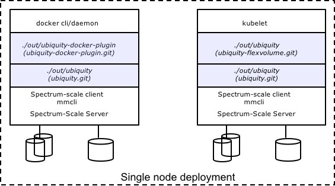
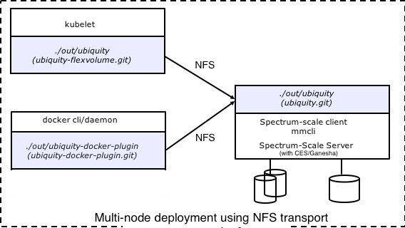

# Ubiquity Storage Service for Container Ecosystems 
[](https://travis-ci.org/IBM/ubiquity)[](https://godoc.org/github.com/IBM/ubiquity)[](http://www.apache.org/licenses/LICENSE-2.0)[](https://goreportcard.com/report/github.com/IBM/ubiquity)

The Ubiquity project implements a service that manages access to persistent storage for containers orchestrated by container frameworks such as Kubernetes or Docker Swarm where scale, velocity and access privileges makes manual mounting of volumes into containers unpractical. 

Ubiquity is a pluggable framework that can support a variety of storage backends and can be complemented by container framework adapters that map the different ways container frameworks deal with storage management into REST calls to the Ubiquity service. 


Different container frameworks can use the service concurrently and allow access to different kinds of storage systems. Currently, the following frameworks are supported:

- [Kubernetes](https://github.com/IBM/ubiquity-k8s)
- [Docker](https://github.com/IBM/ubiquity-docker-plugin)

This repository contains the storage service code. The individual container framework adapters are in separated projects pointed to by the links. 

See [Available Storage Systems](supportedStorage.md) for more details on the storage backends supported and their configuration.

The Ubiquity service can be run on one or more nodes in the cluster to create, manage, and delete storage volumes.  

This code is provided "AS IS" and without warranty of any kind.  Any issues will be handled on a best effort basis.

## Sample Deployment Options
The service can be deployed in a variety of ways.  In all options,
- Ubiquity must be deployed on a system that has access (e.g., CLI, REST, ssh) to the supported storage system
- There is a single instance of the Ubiquity service deployed across the entire cluster.  All volume plugins on the docker or Kubernetes hosts will access this single Ubiquity service for volume management.

We use the IBM Spectrum Scale file system as an example storage system.

#### Single Node (All in One)


This deployment is intended for development purposes or to evaluate Ubiquity.  Spectrum Scale, Docker or Kubernetes, and Ubiquity are all installed on a single server

#### Multi-node using Native GPFS (POSIX)


This deployment shows a Kubernetes pod or cluster as well as a Docker Swarm cluster using Ubiquity to manage a single set of container volumes in Spectrum Scale.  Note that showing both Kubernetes and Docker Swarm is just to demonstrate the capabilities of Ubiquity, and either one could be used in isolation.  In this deployment, Ubiquity is installed on a single Spectrum Scale server (typically a dedicated node for running management services such as the GUI or Zimon).  The actual Spectrum Scale storage cluster consists of a client running on each of the Kubernetes/Docker hosts as well as a set of NSD storage servers.  

#### Multi-node using NFS Protocol


This is identical to the previous deployment example except that the Kubernetes or Docker Swarm hosts are using NFS to access their volumes.  Note that a typical Spectrum Scale deployment would have several CES NFS servers (protocol servers) and the Ubiquity service could be installed on one of those servers or on a separate management server (such as the node collecting Zimon stats or where the GUI service is installed).

#### Multi-node using Native GPFS(POSIX) and Docker Swarm

In this deployment, the Ubiquity service is installed and running on a single Spectrum Scale server. [Ubiquity Docker Plugin](https://github.com/IBM/ubiquity-docker-plugin) is installed and running on all nodes (Docker Hosts that are acting as clients to the Spectrum Scale Storage Cluster) that are part of the Docker Swarm cluster, including the Swarm Manager and the Worker Nodes. The Ubiquity Docker Plugin, running on all the Swarm Nodes, must be configured to point to the single instance of Ubiquity service running on the Spectrum Scale server.

## Installation
### Build Prerequisites
  * Install [golang](https://golang.org/) (>=1.6)
  * Install [git](https://git-scm.com/book/en/v2/Getting-Started-Installing-Git)
  * Install gcc
  * Configure go - GOPATH environment variable needs to be correctly set before starting the build process. Create a new directory and set it as GOPATH 
  
### Deployment Prerequisites
Once the Ubiquity binary is built, then the only requirements on the node where it is deployed is that the Ubiquity service has access to a deployed storage service that will be used by the containers.  The type of access Ubiquity needs to the storage service depends on the storage backend that is being used.  See 'Available Storage Systems' for more details.
  

### Configuration

* Create User and Group named 'ubiquity'

```bash
adduser ubiquity
```

* Modify the sudoers file so that user and group 'ubiquity' can execute Spectrum Scale commands as root

```bash
## Entries for Ubiquity
ubiquity ALL= NOPASSWD: /usr/lpp/mmfs/bin/, /usr/bin/, /bin/
Defaults:%ubiquity !requiretty
Defaults:%ubiquity secure_path = /sbin:/bin:/usr/sbin:/usr/bin:/usr/lpp/mmfs/bin
```

### Download and Build Source Code

```bash
mkdir -p $HOME/workspace
export GOPATH=$HOME/workspace
```
* Configure ssh-keys for github.com - go tools require password less ssh access to github. If you have not already setup ssh keys for your github profile, please follow steps in 
(https://help.github.com/enterprise/2.7/user/articles/generating-an-ssh-key/) before proceeding further. 
* Build Ubiquity service from source (can take several minutes based on connectivity)
```bash
mkdir -p $GOPATH/src/github.com/IBM
cd $GOPATH/src/github.com/IBM
git clone git@github.com:IBM/ubiquity.git
cd ubiquity
./scripts/build
```

### Configuring the Ubiquity Service

Unless otherwise specified by the `configFile` command line parameter, the Ubiquity service will
look for a file named `ubiquity-server.conf` for its configuration.

The following snippet shows a sample configuration file in the case where Ubiquity service is deployed on a system with native access (CLI) to the Spectrum Scale Storage system.

Note that the file system chosen for where to store the DB that tracks volumes is important.  Ubiquity uses a sqllite db, and so can support any storage location that sqllite supports.  This can be a local file system such as Ext4, NFS (if exclusive access is ensured from a single host), or a parallel file system such as Spectrum Scale.  In our example above, we are storing the DB in Spectrum Scale to support failover as well as provide availability and durability of the db data.


```toml
port = 9999                       # The TCP port to listen on
logPath = "/tmp/ubiquity"         # The Ubiquity service will write logs to file "ubiquity.log" in this path.  This path must already exist.
defaultBackend = "spectrum-scale" # The "spectrum-scale" backend will be the default backend if none is specified in the request

[SpectrumScaleConfig]             # If this section is specified, the "spectrum-scale" backend will be enabled.
defaultFilesystemName = "gold"    # Default name of Spectrum Scale file system to use if user does not specify one during creation of a volume.  This file system must already exist.
configPath = "/gpfs/gold/config"  # Path in an existing filesystem where Ubiquity can create/store volume DB.
nfsServerAddr = "CESClusterHost"  # IP/hostname of Spectrum Scale CES NFS cluster.  This is the hostname that NFS clients will use to mount NFS volumes. (required for creation of NFS accessible volumes)

# Controls the behavior of volume deletion.  If set to true, the data in the the storage system (e.g., fileset, directory) will be deleted upon volume deletion.  If set to false, the volume will be removed from the local database, but the data will not be deleted from the storage system.  Note that volumes created from existing data in the storage system should never have their data deleted upon volume deletion (although this may not be true for Kubernetes volumes with a recycle reclaim policy).
forceDelete = false 
```

To support running the Ubiquity service on a host (or VM or container) that doesn't have direct access to the Spectrum Scale CLI, also add the following items to the config file to have Ubiquity use password-less SSH access to the Spectrum Scale Storage system:

```toml
[SpectrumScaleConfig.SshConfig]   # If this section is specified, then the "spectrum-scale" backend will be accessed via SSH connection
user = "ubiquity"                 # username to login as on the Spectrum Scale storage system
host = "my_ss_host"                # hostname of the Spectrum Scale storage system
port = "22"                       # port to connect to on the Spectrum Scale storage system
```


__IBM Block Storage Systems Support__

To support running the Ubiquity service for IBM Block Storage systems, please follow the instructions and configuration below:
* Ubiquity communicates with the IBM storage systems through IBM Spectrum Control Base Edition 3.2.0 or later.
See [IBM Knowledge Center](http://www.ibm.com/support/knowledgecenter/STWMS9/landing/IBM_Spectrum_Control_Base_Edition_welcome_page.html) for instructions on how download, install and configure Spectrum Control Base Edition software.
After IBM Spectrum Control Base Edition is installed, do the following :
    1. Log into Spectrum Control Base Edition server at https://SCBE_IP_address:8440.
    2. Add a Ubiquity interface. Note: The Ubiqity interface username and the password will be used in the ubiquity server configuration file below.
    3. Add the IBM storage systems to be used with the Ubiquity plug-in.
    4. Create storage service(s) with required storage capacities and capabilities. This service(s) will be available for provisioning (as a profile option) from the plugin side ([docker](https://github.com/IBM/ubiquity-docker-plugin), [kubernetes](https://github.com/IBM/ubiquity-k8s))
    5. Delegate at least one storage service to the Ubiquity interface.

* The following snippet shows a sample configuration file for Ubiquity service for IBM Block Storage System:
```toml
port = 9999                       # The TCP port to listen on
logPath = "/tmp/ubiquity"         # The Ubiquity service will write logs to file "ubiquity.log" in this path.  This path must already exist.
defaultBackend = "scbe" # The "spectrum-scale" backend will be the default backend if none is specified in the request

[ScbeConfig]
configPath = "/opt/ubiquity-db" # Path in an existing filesystem where Ubiquity can create/store volume DB.
DefaultService = "gold"         # SCBE storage service to be used by default if not mentioned by plugin
DefaultVolumeSize = "5"         # The default volume size in case not specified by user (default is 1gb), possible UNITs gb,mb,b.
UbiquityInstanceName = "instance1" # A prefix for any new created volume on the storage system side (default empty)

[ScbeConfig.ConnectionInfo]
managementIp = "IP Address"     # SCBE server IP or FQDN
port = 8440                     # SCBE server port. This setting is optional (default port is 8440).
SkipVerifySSL = false           # True verifies SCB SSL certificate or False ignores the certificate (default is True)

[ScbeConfig.ConnectionInfo.CredentialInfo]
username = "user"               # user name defined for SCBE Ubiquity interface
password = "password"           # password defined for SCBE Ubiquity interface

[SpectrumScaleConfig]
configPath = "/opt/ubiquityDB"  # Path in an existing filesystem where Ubiquity can create/store volume DB.
```

### Two Options to Install and Run

#### Option 1: systemd
This option assumes that the system that you are using has support for systemd (e.g., ubuntu 14.04 does not have native support to systemd, ubuntu 16.04 does.)

1)  Inside the almaden-containers/ubiquity/scripts directory, execute the following command
```bash
./setup
```

This command will copy binary ubiquity to /usr/bin, ubiquity-server.conf and ubiquity-server.env  to /etc/ubiquity location. It will also enable Ubiquity service using "systemctl enable"

2) Make appropriate changes to /etc/ubiquity/ubiquity-server.conf

3) Edit /etc/ubiquity/ubiquity-server.env to add/remove command line options to ubiquity server

4) Once above steps are done we can start/stop ubiquity server using systemctl command as below
```bash
systemctl start/stop/restart ubiquity
```

#### Option 2: Manual
```bash
./bin/ubiquity [-configFile <configFile>]
```
where:
* configFile: Configuration file to use (defaults to `./ubiquity-server.conf`)


### Next Steps - Install a plugin for Docker or Kubernetes
To use Ubiquity, please install appropriate storage-specific plugin ([docker](https://github.com/IBM/ubiquity-docker-plugin), [kubernetes](https://github.com/IBM/ubiquity-k8s))


## Additional Considerations
### High-Availability
Ubiquity supports an Active-Passive model of availability.  Currently, handling failures of the Ubiquity service must be done manually, although there are several possible options.

The Ubiquity service can be safely run on multiple nodes in an active-passive manner.  Failover can then be manually achieved by switching the Ubiquity service hostname, or automatically through use of a HTTP load balancer such as HAProxy (which could be run in containers by K8s or Docker).

Moving forward, we will leverage Docker or K8s specific mechanisms to achieving high-availability by running the Ubiquity service in containers or a pod.


## Roadmap

 * Support OpenStack Manila storage back-end
 * Add explicit instructions on use of certificates to secure communication between plugins and Ubiquity service
 * API for updating volumes
 * Additional options to explore more features of Spectrum Scale, including use of the Spectrum Scale REST API.
 * Containerization of Ubiquity for Docker and Kubernetes
 * Support for additional IBM storage systems
 * Support for CloudFoundry

## Contribution:
Our team welcoms any contribution or bug fixes ...
To contribute please follow the guidelines in [Contribution guide](contribution-guide.md)
## Suggestions and Questions
For any questions, suggestions, or issues, please use github.

