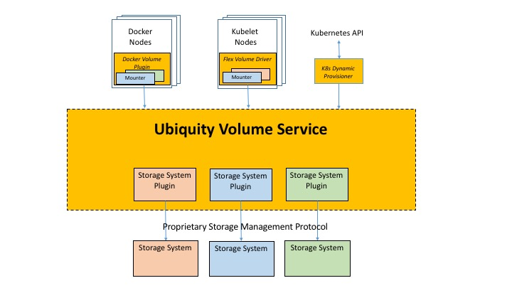

# Ubiquity Storage Service for Container Ecosystems 
[](https://travis-ci.org/IBM/ubiquity)
[](https://godoc.org/github.com/IBM/ubiquity)
[](https://coveralls.io/github/IBM/ubiquity?branch=dev)
[](http://www.apache.org/licenses/LICENSE-2.0)
[](https://goreportcard.com/report/github.com/IBM/ubiquity)

The Ubiquity project enables persistent storage for the Kubernetes and Docker container frameworks. 
It is a pluggable framework available for different storage systems. The framework interfaces with the storage systems, using their plugins. The [Available Storage Systems](supportedStorage.md) section describes the storage system  configuration and deployment options. Different container frameworks can use Ubiquity concurrently, allowing access to different storage systems. 




Ubiquity supports the Kubernetes and Docker frameworks, using the following plugins:

- [Ubiquity Docker volume plugin](https://github.com/IBM/ubiquity-docker-plugin)
- [Ubiquity plugin for Kubernetes](https://github.com/IBM/ubiquity-k8s) (Dynamic Provisioner and FlexVolume)

The code is provided as is, without warranty. Any issue will be handled on a best-effort basis.

## Installing the Ubiquity service

### 1. Prerequisites
  * Ubiquity is available on the following operating systems:
    - RHEL 7+
    - SUSE 12+
    - Ubuntu 16+
  * The following sudoers configuration `/etc/sudoers` is required to run the Ubiquity process as root user: 
  
     ```
        Defaults !requiretty
     ```
     For non-root users, such as USER, configure the sudoers as follows: 

     ```
         USER ALL= NOPASSWD: /usr/bin/, /bin/
         Defaults:%USER !requiretty
         Defaults:%USER secure_path = /sbin:/bin:/usr/sbin:/usr/bin
     ```

        
  * Configure your [storage backend](supportedStorage.md). 

### 2. Downloading and installing the Ubiquity service 

  * Download and unpack the application package.
```bash
mkdir -p /etc/ubiquity
cd /etc/ubiquity
curl -L https://github.com/IBM/ubiquity/releases/download/v0.4.0/ubiquity-0.4.0.tar.gz | tar xzf -
chmod u+x ubiquity
cp ubiquity /usr/bin/ubiquity                
#chown USER:GROUP /usr/bin/ubiquity  # Run this command only if non-root should run ubiquity (fill up the USER and GROUP)
cp ubiquity.service /usr/lib/systemd/system/ 
```
   * To run the ubiquity as non-root users, you must add to the `/usr/lib/systemd/system/ubiquity.service` file this line `User=USER` under the [Service] item.
   
   * Enable the Ubiquity service
   
```bash 
systemctl enable ubiquity.service         
```

### 3. Configuring the Ubiquity service
Before running the Ubiquity service, you must create and configure the `/etc/ubiquity/ubiquity-server.conf` file, according to your storage system type.
Follow the configuration procedures detailed in the [Available Storage Systems](supportedStorage.md) section.


### 4. Running the Ubiquity service
  * Run the service.
```bash
systemctl start ubiquity    
```


### 5. Installing Ubiquity plugins for Docker or Kubernetes
To use the active Ubiquity service, install Ubiquity plugins for the relevant container framework. The plugin packages and installation instructions are available in seperate github repositories.
  * [Ubiquity Docker volume plugin](https://github.com/IBM/ubiquity-docker-plugin)
  * [Ubiquity Kubernetes plugin](https://github.com/IBM/ubiquity-k8s)


## Roadmap
 * Make Ubiquity Docker volume plugin in Docker store
 * Containerize Ubiquity service for Docker and Kubernetes
 * Add more IBM storage systems as Ubiquity backends
 * Add OpenStack Manila storage as Ubiquity backend
 * Add Cloud Foundry, as a container framework
 * Secure communication between plugins and Ubiquity service, using certificates
 * Enable volume sharing between multiple nodes
 * And more goodies to come...


## Contribution
To contribute, follow the guidelines in [Contribution guide](contribution-guide.md)


## Troubleshooting
* Review the Ubiquity logs for any issues:
    * [logPath]/ubiquity.log   ([logPath] configured in the ubiquity-server.conf)
    * /var/log/messages        

## Support
For any questions, suggestions, or issues, use github.

## Licensing

Copyright 2016, 2017 IBM Corp.

Licensed under the Apache License, Version 2.0 (the "License");
you may not use this file except in compliance with the License.
You may obtain a copy of the License at

http://www.apache.org/licenses/LICENSE-2.0

Unless required by applicable law or agreed to in writing, software
distributed under the License is distributed on an "AS IS" BASIS,
WITHOUT WARRANTIES OR CONDITIONS OF ANY KIND, either express or implied.
See the License for the specific language governing permissions and
limitations under the License.
