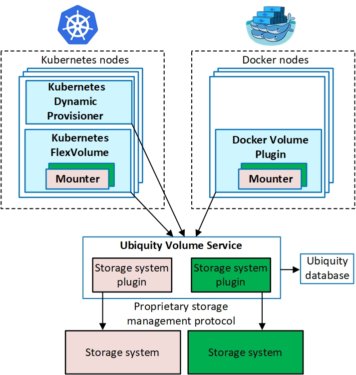

# Ubiquity Storage Service for Container Ecosystems 

The Ubiquity project enables persistent storage for the Kubernetes and Docker container frameworks. It is a pluggable framework available for different storage systems. The framework interfaces with the storage systems, using their plugins. Different container frameworks can use Ubiquity concurrently, allowing access to different storage systems.

Ubiquity supports the Kubernetes and Docker frameworks, using the following plugins:

- [Ubiquity plugin for Kubernetes](https://github.com/IBM/ubiquity-k8s) (Dynamic Provisioner and FlexVolume)
- [Ubiquity Docker volume plugin](https://github.com/IBM/ubiquity-docker-plugin), for testing only.

Currently, the following storage systems use Ubiquity:
* IBM block storage.

   The IBM block storage is supported for Kubernetes via IBM Spectrum Connect. Ubiquity communicates with the IBM storage systems through Spectrum Connect. Spectrum Connect creates a storage profile (for example, gold, silver or bronze) and makes it available for Kubernetes. For details about supported storage systems, refer to the latest Spectrum Connect release notes.
   
   The IBM official solution for Kubernetes, based on the Ubiquity project, is referred to as IBM Storage Enabler for Containers. You can download the installation package and its documentation from [IBM Fix Central](https://www.ibm.com/support/fixcentral/swg/selectFixes?parent=Software%2Bdefined%2Bstorage&product=ibm/StorageSoftware/IBM+Spectrum+Connect&release=All&platform=Linux&function=all). For details on the IBM Storage Enabler for Containers, see the relevant sections in the Spectrum Connect user guide.

* IBM Spectrum Scale, for testing only.

The code is provided as is, without warranty. Any issue will be handled on a best-effort basis.

## Solution overview

Description of Ubiquity Kubernetes deployment:
   *   Ubiquity Kubernetes Dynamic Provisioner (ubiquity-k8s-provisioner) runs as a Kubernetes deployment with replica=1.
   *   Ubiquity Kubernetes FlexVolume (ubiquity-k8s-flex) runs as a Kubernetes daemonset on all the worker and master nodes.
   *   Ubiquity (ubiquity) runs as a Kubernetes deployment with replica=1.
   *   Ubiquity database (ubiquity-db) runs as a Kubernetes deployment with replica=1.

## Contribution
To contribute, follow the guidelines in [Contribution guide](contribution-guide.md)

## Support
For any questions, suggestions, or issues, use Github.

## Licensing

Copyright 2016, 2017 IBM Corp.

Licensed under the Apache License, Version 2.0 (the "License");
you may not use this file except in compliance with the License.
You may obtain a copy of the License at

http://www.apache.org/licenses/LICENSE-2.0

Unless required by applicable law or agreed to in writing, software
distributed under the License is distributed on an "AS IS" BASIS,
WITHOUT WARRANTIES OR CONDITIONS OF ANY KIND, either express or implied.
See the License for the specific language governing permissions and
limitations under the License.
