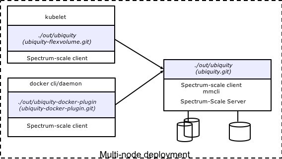

#Ubiquity Storage service for Container Ecosystems
Ubiquity provides access to persistent storage for Docker containers
### Supported Deployment Options
#### Single node (all in one)

#### Multi-node

### Prerequisites
  * Provision a system running Spectrum-Scale client and NSD server
  * Install [golang](https://golang.org/) (>=1.6)
  * Install git
  * Install gcc

### Getting started
* Configure go - GOPATH environment variable needs to be correctly set before starting the build process. Create a new directory and set it as GOPATH 
```bash
mkdir -p $HOME/workspace
export GOPATH=$HOME/workspace
```
* Configure ssh-keys for github.ibm.com - go tools require password less ssh access to github. If you have not already setup ssh keys for your github.ibm profile, please follow steps in 
(https://help.github.com/enterprise/2.7/user/articles/generating-an-ssh-key/) before proceeding further. 
* Build Ubiquity service from source (can take several minutes based on connectivity)
```bash
mkdir -p $GOPATH/src/github.ibm.com/almaden-containers
cd $GOPATH/src/github.ibm.com/almaden-containers
git clone git@github.ibm.com:almaden-containers/ubiquity.git
cd ubiquity
./scripts/build

```
* Run Ubiquity service
```bash
./bin/ubiquity -listenPort <> -logPath <> -spectrumConfigPath <> -spectrumDefaultFilesystem <>
```
where:
* listenPort: Port to serve ubiquity functions
* logPath: Path to create ubiquity log file
* spectrumConfigPath: Path in an existing spectrum-scale filesystem where ubiquity can create/store metadata DB
* spectrumDefaultFilesystem: Default existing spectrum-scale filesystem to use if user does not specify one during creation of volumes
Examples invocation of binary:
```bash
./bin/ubiquity -listenPort 8999 -logPath /tmp -spectrumConfigPath /gpfs/gold/ -spectrumDefaultFilesystem gold
```
### Next steps
- Install appropriate plugin ([docker](https://github.ibm.com/almaden-containers/ubiquity-docker-plugin), [kubernetes](https://github.ibm.com/almaden-containers/ubiquity-flexvolume))
